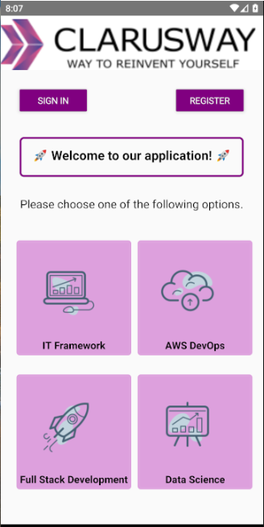
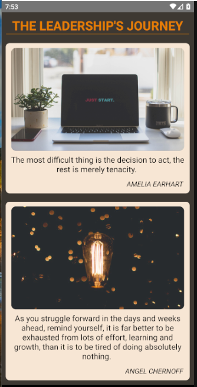
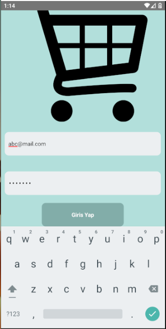
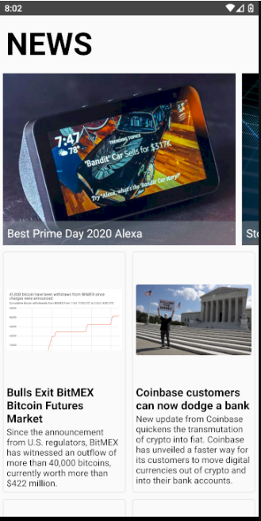
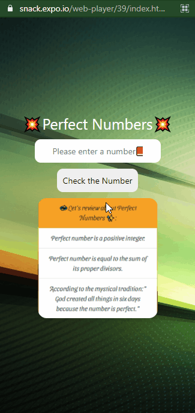

 
  
<h1 align="center">Index of React Native Projects</h1>

<table>
    <thead>
        <tr>
            <td>Project Name</td>
            <td>Repo Link</td>
            <td>App Link</td>
            <td>Overview</td>
        </tr>
    </thead>
    <tbody> 
        <tr>
            <td>First Experience</td>
            <td><a href="https://github.com/nurkocar/MyVeryFirstReactNative-Project" target="_blank">Repo details</a></td>
            <td><a href="https://github.com/nurkocar/MyVeryFirstReactNative-Project/blob/main/README.md">Click here to see the project</a></td>
            <td></td> 
        </tr>
        <tr>
            <td>ClarusApp Landing Page </td>
            <td><a href="https://github.com/nurkocar/Clarusway-Application" target="_blank">Repo details</a></td>
            <td><a href="https://github.com/nurkocar/Clarusway-Application/blob/main/README.md" target="_blank">Click here to see the project</a></td>
            <td></td> 
        </tr>
        <tr>
            <td>The LeaderShip's Journey</td>
            <td><a href="https://github.com/nurkocar/Reusable-Component" target="_blank">Repo details</a></td>
            <td><a href="https://github.com/nurkocar/Reusable-Component/blob/main/README.md" target="_blank">Click here to see the project</a></td>
            <td></td> 
        </tr>
        <tr>
            <td>Login Page</td>
            <td><a href="https://github.com/nurkocar/Login-Page" target="_blank">Repo details</a></td>
            <td><a href="https://github.com/nurkocar/Login-Page/blob/main/README.md" target="_blank">Click here to see the project</a></td>
            <td></td> 
        </tr>
        <tr>
            <td>News App</td>
            <td><a href="https://github.com/nurkocar/News-Page" target="_blank">Repo details</a></td>
            <td><a href="https://github.com/nurkocar/News-Page/blob/main/README.md" target="_blank">Click here to see the project</a></td>
            <td></td> 
        </tr>
        <tr>
            <td>Functional vs Class Component</td>
            <td><a href="https://github.com/nurkocar/Functional-vs-Class-Component" target="_blank">Repo details</a></td>
            <td><a href="https://github.com/nurkocar/Functional-vs-Class-Component" target="_blank">Click here to see the project</a></td>
            <td></td> 
        </tr>
        <tr>
            <td>To Do App</td>
            <td><a href="https://github.com/nurkocar/To-Do-App" target="_blank">Repo details</a></td>
            <td><a href="https://github.com/nurkocar/To-Do-App" target="_blank">Click here to see the project</a></td>
            <td></td> 
        </tr>
        <tr>
            <td>React Navigation</td>
            <td><a href="https://github.com/nurkocar/React-Navigation" target="_blank">Repo details</a></td>
            <td><a href="https://github.com/nurkocar/React-Navigation" target="_blank">Click here to see the project</a></td>
            <td></td> 
        </tr>
        <tr>
            <td>Like-Unlike Posts</td>
            <td><a href="https://github.com/nurkocar/Like-or-Unlike-Posts" target="_blank">Repo details</a></td>
            <td><a href="https://github.com/nurkocar/Like-or-Unlike-Posts/blob/main/README.md" target="_blank">Click here to see the project</a></td>
            <td></td> 
        </tr>
        <tr>
            <td>Nesting-Navigators</td>
            <td><a href="https://github.com/nurkocar/Nesting-Navigators" target="_blank">Repo details</a></td>
            <td><a href="https://github.com/nurkocar/Nesting-Navigators" target="_blank">Click here to see the project</a></td>
            <td></td> 
        </tr>
        <tr>
            <td>Suggest Restaurant</td>
            <td><a href="https://github.com/nurkocar/Web-API" target="_blank">Repo details</a></td>
            <td><a href="https://github.com/nurkocar/Web-API" target="_blank">Click here to see the project</a></td>
            <td></td> 
        </tr>
        <tr>
            <td>Yelp App (Restaurant in selected Cities)</td>
            <td><a href="https://github.com/nurkocar/City-Yelp-App" target="_blank">Repo details</a></td>
            <td><a href="https://github.com/nurkocar/City-Yelp-App" target="_blank">Click here to see the project</a></td>
            <td></td> 
        </tr>
        <tr>
            <td>Redux 1</td>
            <td><a href="https://github.com/nurkocar/React-Reduxp" target="_blank">Repo details</a></td>
            <td><a href="https://github.com/nurkocar/React-Redux" target="_blank">Click here to see the project</a></td>
            <td></td> 
        </tr>
        <tr>
            <td>Redux 2</td>
            <td><a href="https://github.com/nurkocar/React-Redux-2" target="_blank">Repo details</a></td>
            <td><a href="https://github.com/nurkocar/React-Redux-2" target="_blank">Click here to see the project</a></td>
            <td></td> 
        </tr>
        <tr>
            <td>Redux 2</td>
            <td><a href="https://github.com/nurkocar/React-Redux-2" target="_blank">Repo details</a></td>
            <td><a href="https://github.com/nurkocar/React-Redux-2" target="_blank">Click here to see the project</a></td>
            <td></td> 
        </tr>
        <tr>
            <td>Perfect Number App</td>
            <td><a href="https://github.com/nurkocar/Perfect-Number-App" target="_blank">Repo details</a></td>
            <td><a href="https://snack.expo.io/@nur_k/perfectnumber" target="_blank">Click here to see the project</a></td>
            <td></td> 
        </tr>
        <tr>
            <td>Redux 2</td>
            <td><a href="https://github.com/nurkocar/React-Redux-2" target="_blank">Repo details</a></td>
            <td><a href="https://github.com/nurkocar/React-Redux-2" target="_blank">Click here to see the project</a></td>
            <td></td> 
        </tr>
        

</tbody>
</table>
